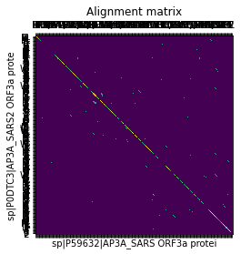
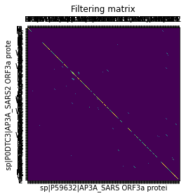
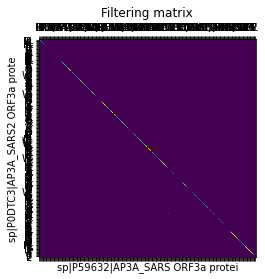

## Visual tour

Okay let's start off with the eye candy.

Figure 1 is the alignment matrix of P59632 (SARS-CoV ORF3a, horizontal), and P0DTC3 (SARS-CoV-2 ORF3a, vertical). The alignment was done with the `hamming_distance_inverse` function, and with a `window_size` of 5.

{width=50%}

After applying one `addition_pass`, the filtering matrix can be seen in Figure 2.

{width=50%}

Subsequently, a `shortening_pass` is applied, and the filtering matrix, as seen in Figure 3, is now rather more sparse.

{width=50%}

The report of longest substrings as found using these passes, produced the following result:

```
Comparing
	s:  275	sp|P0DTC3|AP3A_SARS2 ORF3a protein OS=Severe acute r...
	t:  274	sp|P59632|AP3A_SARS ORF3a protein OS=Severe acute re...
Done, completed in 0.003 seconds
	start     	end       	len 
	——————————	——————————	————
	(117, 117)	(163, 163)	  47
s:  INFVRIIMRLWLCWKCRSKNPLLYDANYFLCWHTNCYDYCIPYNSVT
    ||  ||||| |||||| |||||||||||| ||||  |||||||||||
t:  INACRIIMRCWLCWKCKSKNPLLYDANYFVCWHTHNYDYCIPYNSVT
	(27, 27)  	(72, 72)  	  46
s:  FVRATATIPIQASLPFGWLIVGVALLAVFQSASKIITLKKRWQLAL
     | |||||| |||||||||  ||| ||||||| ||| | |||||||
t:  TVHATATIPLQASLPFGWLVIGVAFLAVFQSATKIIALNKRWQLAL
	(77, 77)  	(115, 115)	  39
s:  HFVCNLLLLFVTVYSHLLLVAAGLEAPFLYLYALVYFLQ
     | ||||||||| |||||||||| || ||||||| ||||
t:  QFICNLLLLFVTIYSHLLLVAAGMEAQFLYLYALIYFLQ
	(240, 241)	(271, 272)	  32
s:  EHVQIHTIDGSSGVVNPVMEPIYDEPTTTTSV
      |||||||||||| || | ||||||||||||
t:  PNVQIHTIDGSSGVANPAMDPIYDEPTTTTSV
```


## Practical application
<!-- What is the practical application of your program? -->

My aligner package can be used to align two sequences using a variety of
different alignment and filtering methods by manipulating an alignment matrix. 
The aligner is mainly geared towards the analysis and alignment of protein
sequences. However, sequences of any kind can be processed, but some methods of
alignment and analysis only lend themselves to the analysis of protein
sequences. Nucleotide data, for instance, can be studied very well using this
package, as well, but the alignment can only be done using a pairwise equality
of the nucleotides, or by calculating the Hamming distance between windows of
the sequence. Protein analysis lends access to scoring using the BLOSUM62
table, as well as scoring according to difference in hydropathy. The package
also allows for finding long aligned similar or equal substrings between the
sequences.

Besides aligning, processing, and analysing the sequences, I have also
implemented methods of viewing the data that flows through the program. Most
importantly, the alignment matrix (containing the initial alignment data), and
the filtering matrix (the matrix that is mutated and serves as input for
processing passes) can be viewed using plotting functions. These functions are
built on the [matplotlib](https://matplotlib.org/) library, and allow the user
to create diagrams of the matrices, but also interact with the figures, and
studying the sequences by exploring the matrices.

The methods of processing and visualizing sequences might aid in resolving
sequence homologies, duplication and deletion events, conserved regions, &C.
Though these capabilities have not been rigorously and robustly codified and
implemented, I find that the creation of the package and the capabilities it
now includes already show somewhat interesting results which spark my curiosity
for new ways of analysing protein sequence data. Ways of viewing and processing
protein alignments that may in fact be actually useful, maybe even slightly
novel.

I have also created a small set of useful utility functions I use throughout
the package. The use of these utilities extends beyond the package itself,
however, because they can also be used to retrieve data for use _with_ my
package in new programs. These capabilities are used in the
`explorations.ipynb` Jupyter Notebook, where I show how the aligner package can
be imported and used to study protein sequences together with their structure
data. 

## Features
<!-- What can it do? -->

I will now continue with expanding on the specific methods included in my
package. At the core of the package lies a class `Aligner` which can be
initiated with two fasta entries, containing the sequences of interest.
With this instance, the alignment can be applied. 

This will serve as an overview, but the
[documentation](file:./doc/aligner.html) gives a much better overview of these
functions than I can give here, because of the doc-strings and function
signatures that can be seen there.

### Aligning

An alignment matrix is constructed from the two sequences. There are multiple
methods for alignment. There are two main types of alignment. 

First, there are alignment methods that score in a pairwise manner. For each
cell in the alignment matrix only the two corresponding items from each of the
sequences are considered. 

Second, there are windowed alignments. These score according to a
window including and around the cell which is scored. This might allow
homologies to be resolved which might go undetected in different methods,
because the area around a point in the sequences is scored. 

### Filtering

The alignment matrix can then be processed using a number of filtering
functions, the filter 'pass' methods. These are applied to and return the
filtering matrix of the `Aligner` class.

- `addition_pass`
- `shortening_pass`
- `normalize_pass`
- `threshold_pass`
- `squaring_pass`
- `log_pass`
- `lifting_pass`

### Finding long substrings

The filtering passes can be used to resolve certain long diagonals. These can
be retrieved from the alignment matrix with intra-diagonal positions retrieved
from the filtering matrix, using the `Aligner.longest_substrings` method. This
returns a sorted list of the longest substrings found. A method
`Aligner.long_substrings_report` also exists, and it reports on these
substrings by printing a table of the 10 longest substrings, including their
length, start and end points, and their sequences, and with a strip showing
matches and mismatches between the two substrings from the different sequences.

## Limitations
<!-- What can't it do? What are its limitations? -->

Though the package can do a whole bunch of little tricks and operations, it is
in no real way helpful in rigorously resolving structure and homology that
would not be obvious through other methods. There is no application of
statistical methods to discriminate noise from signal. Most importantly,
anything that this package does help resolve is seen through human eyes, and in
no way detectable by the program. In order to achieve this, I would need to
implement algorithms to find particular features, or apply machine learning
methods to create models which can resolve these features.

## Rationale
<!-- Why did I structure my solution this way? Why did I create these functions? -->

Almost all of the information on _how_ the functions work, and _what_ they do
can be found in the documentation within the source code, or be accessed in
[`./doc/aligner.html`](file:./doc/aligner.html). Here, I will explain the _why_
of the structure of the package.

### The `Aligner` class

The package comprises three main parts. First, and at the heart of the package,
`aligner.py` contains the `Aligner` class, which is the main point of
interaction for programs using the aligner package. Inside of the class, there
are methods that allow for creation, processing, and visualisation of the
sequences and data in the `Aligner` class. These methods call functions that
are in `aligner.py`, in the case of the functions concerned with scoring,
alignment, and substring finding. In case of the `*_pass` methods, the
`_generic_pass` function is called with a function pointer as its parameter. 

### Methods for constructing the alignment matrix

As described in the section on application, different methods of alignment can
be applied, which can be divided into two main categories: pairwise and
windowed. The `Aligner.construct_alignment_matrix` function takes care of the
pairwise alignment matrix construction, and can take a function pointer to the
built-in Kyte-Doolittle and BLOSUM62 functions, `aligner.hydrophobicity_score`
and `aligner.blosum_62`. For the windowed counterpart
`Aligner.construct_windowed_alignment_matrix`, a windowed BLOSUM62 and inverse
Hamming distance function, `blosum_62_windowed` and
`hamming_distance_inverse` are available. However, due to the structure
of these functions, any scoring function can be passed as function parameters,
allowing users of this package to apply their own methods of alignment matrix
construction.

The BLOSUM62 function is based on a dictionary-of-dictionaries lookup table. The BLOSUM62 scoring matrix, put reductively, allows for scoring two amino acids based on their probability of being evolutionarily close. The Kyte-Doolittle hydropathy factor is implemented as a dictionary of floats lookup. Why Kyte-Doolittle hydropathy? I thought this might be an interesting aspect to study, as patterns in hydropathy might reveal transmembrane areas. ~~But most importantly, how can one refuse to implement a function with a name containing the title of the greatest Pixies album!?~~

### Processing the alignment matrix

The `*_pass` function pointers are imported from `matrix_manipulation.py`,
where the functions that are used in the processing and filtering passes are
written. The implementation and rationale for these function is rather trivial,
except for the `add_diagonals` and `shorten_diagonals` functions, I would say.
These lie at the heart of the `Aligner.addition_pass` and
`Aligner.shortening_pass`, respectively. The addition function adds the upper
and lower diagonals for a given cell (that is, North-West and South-East cells)
are added onto the value of the given cell, unless the given cell has a value
of zero, in which case it will remain zero. This algorithm can be described in
one sentence, but the _why_ might not be immediately obvious.
This `add_diagonals` function allows for increasing the values of cells
_within_ diagonals. Over multiple passes, the middle cells of longer diagonals
accumulate high values, which allow them to be scoped out to be used for
finding the longest similar or equal substrings between the two sequences.

The `shorten_diagonals` function performs a similar duty, however, rather than
leaving the length of the diagonals intact as its additive counterpart does, it
shortens diagonals, because it relies on multiplication of a given cell with
its diagonal neighbors. If even one of these neighbors is zero, the given cell
will also be set to zero. This, over multiple pass especially, leads to the
shortening and eventual elimination of shorter diagonals. Long diagonals in the
alignment matrix are thus filtered to become shorter, but they will be the only
diagonals left.

### Retrieving substrings

These passes can all be used to manipulate the filtering matrix to resolve
diagonals and perhaps even other patterns. The passes can be applied until
particularly diagonals of preferred specifications are left. These can then
serve as the seed for finding the extended diagonal as it has been preserved in
the alignment matrix (this, in fact, is the reason I decided on keeping the
alignment matrix intact, and mutating the filtering matrix). The maximum value
within the matrix can be determined, and any cells with that value is an index
at which a diagonal lies. The `walk_up_down` function can take this position
and find the whole diagonal by walking up and down until it finds the edge of
the diagonal in the alignment matrix.

### Visualisation

Shifting our attention back to `aligner.py`, for a second, the `Aligner` class
also implements methods for plotting the alignment and filtering matrices. I
have decided to make these functions methods to `Aligner`, because they are so
tightly linked to all of the information in the class: sequence identifiers,
the sequences themselves, the matrices. I do honestly not love this part of the
implementation, but I think I made an OK choice, though I suspect I will change
my mind on this soon.

### Utilities

Finally, `utilities.py` contains functions that are used to read and write
files, parse fasta file strings into a named tuple called `FastaEntry` which is
used throughout the program, and fetch fasta files from UniProt or RCSB. 
I implemented this myself in order to present my abilities, but in later
versions, I plan on adopting more standardized and broadly-used libraries, such
as [BioPython](https://biopython.org/) to implement and use this functionality
more robustly. Other people have taken more care and time than I might ever
have for this program to make very good implementations of the functions I
hacked together myself.

## Extension

The use of function pointer parameters in a number of different parts of the
package, such as the creation of the alignment matrix and the manipulation of
the filtering matrix, allows users to implement their own scoring and
manipulation functions, and integrate them into the aligner package.

Because the `Aligner` class lends the user a convenient way of creating and
processing alignment matrices, and because these matrices can also be accessed
and treated in novel ways, the package provides a jumping-off point for
quick---dare I say creative---analysis of sequence alignments. 

I have already made use of my package in that use-case. The results of my
explorations can be seen in the `explorations.ipynb` Jupyter Notebook included
in the directory. There, I show a method of mapping the alignment data onto pdb
structure data for structurally similar proteins. Such an image can be seen in
Figure 4.

## Future
<!-- What would you add if you had more time? -->

Given that I feel very motivated to explore the possibilities that I have in
mind for this project, I might actually implement the following ideas in the
near future. 

### Dihedrals 

Inspired by the work of Kim and Tsjerk, I have become very interested in
implementing tools for studying the dihedrals in proteins. Though I think it is
a shame I have not come around to this yet, I am very excited to try my hand at
integrating some of the experiments in these data structures I have laying
around. Thanks Kim for showing me the tip of the
[MDAnalysis](https://www.mdanalysis.org/) iceberg.

By integrating dihedrals data into the alignment considerations, and by coming
up with methods of studying these angles over stretches of amino acids,
completely new stories might be revealed about structure of the protein.
Stories which might go entirely unnoticed when merely looking at sequence data.
Integrating atom position data as found in PDB files, for example, and using
MDAnalysis to find these positions and the angles between them should allow me
to find these dihedral angles and open up a whole new dimension of analysis.

### Grouping sections by function annotation

PDB files contain sections describing regions within the protein structures and
their (possible) functions. By leveraging this information, the methods of
analysis aligner already provides can be applied to specific areas of the
protein. Another possibility is to create a data set of regions with some
function annotation, and to apply the tools in this program to find interesting
patterns in or around those regions.

In other words, using the pre-existing annotations of regions brings existing
structure and function knowledge to the playing field of the tools provided in
aligner. This would also open doors for noticing patterns associated with
particular annotated regions. With such observations, I could develop methods
of detecting such patterns, and use those methods to detect similar patterns in
regions that are not annotated, or not annotated as such.

More broadly, I am interested in integrating more and more of the wealth of
information that is already available into my tool. Doing so might lead to
interesting observations, and further ideas for ways of applying existing
methods in strange new ways.

### A better visualisation suite

Throughout this project, I have found the moments where I am able to visualize
a structure or a concept I was curious about incredibly valuable. Different
methods of visualizing the same data has also lead me to some interesting paths
of curiosity. Therefore, I believe that creating more methods of seeing the
data the program processes, will make new methods unfold before our eyes.

Specifically, I would like to make applying the alignment data onto
3-dimensional protein renders more robust and easier, so that it can be done
through the program itself, rather than in the hand-tuned way I show in the
`explorations.ipynb` Jupyter Notebook. I believe this should be possible, but I
have not come around to that, yet. 

### Extend the command line tool

For years, now, I have lived my computational life almost entirely from the
command line. To me, a good command line interface (cli) can make me feel like
the possibilities of a program lie at my fingertips. To feel like you can do
anything you want with only minimal friction is a critical part of using
computers as a tool for thought, rather than an obstacle. Therefore I see the
value of improving the cli for my program. 

To achieve this, I am planning on rewriting `__main__.py` to use
[argparse](https://docs.python.org/3/library/argparse.html), so I can quickly
create a large suite of options for using the program in the shell. In
addition, it will allow me to flexibly and quickly make any new feature I add
to the program available as an option or subcommand in the cli. My current
setup is nice and minimalistic, and quite fun. However, I do think it has
become time for a more robust solution.
